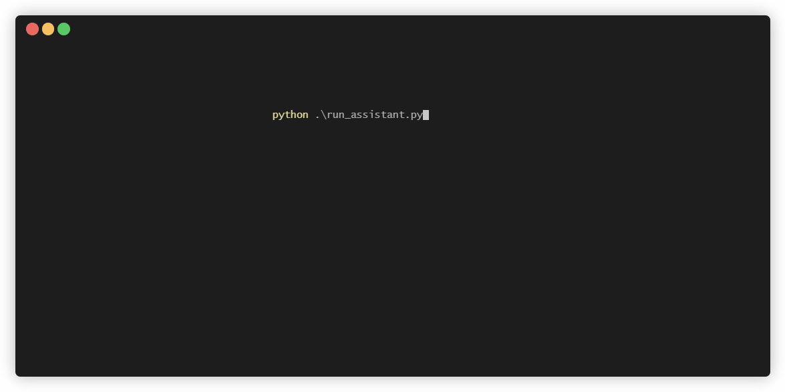

# Gemini Senpai

*Build your software with AI assistant, collaboratively*




## Overview
Agents (autonomous agents or LLM agents) extend the capability of LLMs by equipping them with 
tools, which essentially are functions defined to achieve specific tasks. Google's Gemini has 
introduced support for function calling, much like OpenAI's GPT, allowing the Generative AI models 
to support advanced workflows.

Gemini Senpai is a small, experimental AI assistant prototype built using Gemini's function 
calling. Currently, Gemini Senpai allows users to generate Python code and small Python 
applications spanning multiple modules.


## Usage

Gemini Senpai uses Google's [Vertex AI](https://cloud.google.com/vertex-ai?hl=en) to access the Gemini Pro LLM. You need to have a 
[Google Cloud account and Vertex AI setup](https://cloud.google.com/vertex-ai/docs/start/cloud-environment) together with authentication. Please have a look 
at the ["Quick Start"](https://pypi.org/project/google-cloud-aiplatform/) section and follow the steps. The use of Gemini via AI Studio (i.e., 
using API keys) is not yet supported.

You should verify from your terminal that Google Cloud authentication is working before proceeding 
further.

Get the source code of Gemini Senpai from GitHub:

```bash
git clone git@github.com:barun-saha/gemini_senpai.git
```

Install the requirements:

```bash
cd gemini_senpai
pip install -r requirements.txt
```

Run the assistant:

```bash
python run_assistant.py
```


## Limitations and Known Issues

Gemini Senpai has some limitations, so carefully consider them when using it.

* **Non-deterministic behavior**: LLMs are stochastic models, which lead to non-determinism. This 
is also observed with function calls, so the same prompt may generate different outputs at 
different times. However, with function calling some new issues can be observed, for example, 
selecting a blank tool and specifying the wrong arguments for a selected tool.
  * There is no known mitigation at this point. Try running the same task with Gemini Senpai a few
  times and consider the best output.
* **Not a Swiss Army knife**:  Gemini Senpai provides a few tools so far. It is not meant to 
address every problem under the sun, at least not yet.
  * Try implementing the new tools you need by extending the `ToolInterface` class.
* **File system access and risks**: Gemini Senpai provides a set of tools to interact with 
the local file system, for example, to create files and directories. A potential side effect is 
that these tools can overwrite the content of files having some commonly used names, such as 
`main.py`, `app.py`, and `requirements.txt`.
  * This issue can be usually mitigated by asking Gemini Senpai to create the files inside a
  specific directory. The example prompts illustrate this aspect. However, in rare scenarios, the
  instructions may not be accurately followed. Therefore, you can keep a backup of your files as 
  an additional measure.
    * This issue may be fixed in the future using a LangChain-style work directory.
  * Avoid integrating Gemini Senapi with a Web application without taking further preventive 
  measures.
  * In addition, like any other Python project, run Gemini Senpai using a virtual environment. 
* **Blocked responses**: Google's AI, and Gemini, in particular, has a strong focus on safety. In
particular, Gemini can block certain responses even if the query is benign.
  * Try rephrasing the prompt provided or try running the assistant sometime later.

In other words, even if Gemini Senpai is far from a perfect assistant, it can potentially help 
by providing a good starting point.  


## Acknowledgment

Gemini Senpai borrows code and ideas from different places, such as:

- [Intelligent agents guided by LLMs](https://www.paepper.com/blog/posts/intelligent-agents-guided-by-llms/) (also, [code](https://github.com/mpaepper/llm_agents))
- [Function Calling with the Vertex AI Gemini API & Python SDK](https://github.com/GoogleCloudPlatform/generative-ai/blob/main/gemini/function-calling/intro_function_calling.ipynb)
- [How to implement a chatbot with ReAct prompting and function calling](https://medium.com/@joanboronatruiz/how-to-implement-a-chatbot-with-react-prompting-and-function-calling-6d9badb2fd3)
- [Bing Copilot/GPT](https://www.bing.com/chat)


-----

Gemini Senpai is an experimental prototype (read weekend project). No guarantee whatsoever is 
provided. Use it cautiously after carefully reading the documentation and code.